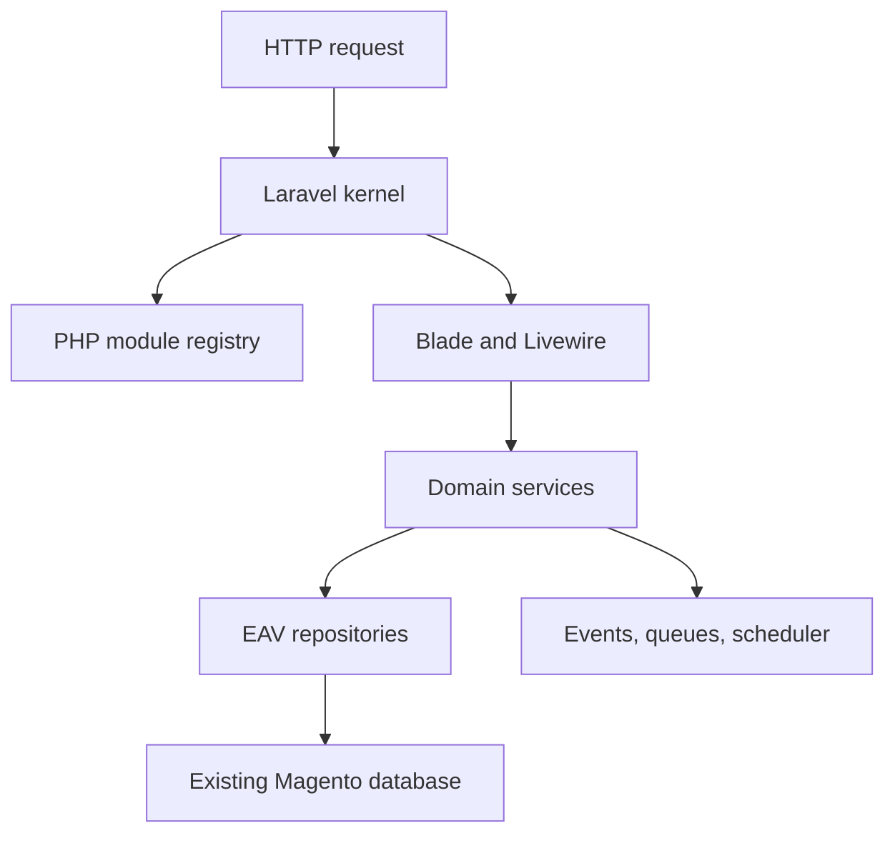

# Architecture

The target application is a modular Laravel system that keeps Magento data contracts stable while replacing runtime internals.

## Key Rules

- New architecture code does not use XML for registration or configuration.
- EAV reads and writes go through dedicated repositories and query services.
- Eloquent is allowed for flat tables where Magento semantics are not hidden.
- Livewire components delegate business rules to services.
- Compatibility bridges are temporary and must have removal criteria.
- The Laravel target uses latest stable PHP; legacy PHP is isolated to Magento baseline verification.
