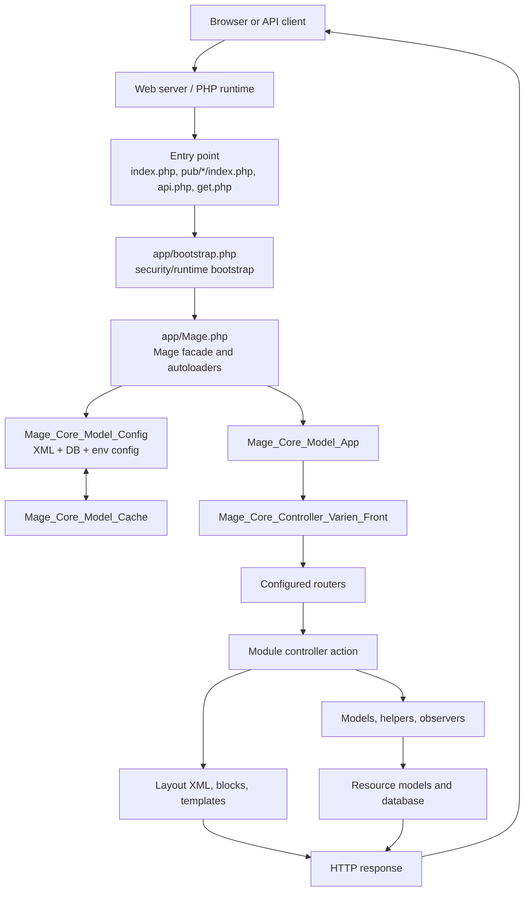
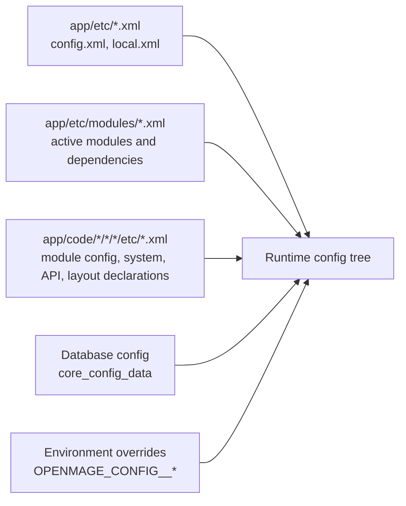

# Architecture

This repository is OpenMage LTS, a community-maintained Magento 1 fork. The code keeps Magento 1 compatibility while modernizing the runtime for PHP 8.x, Composer packages, static analysis, tests, and CI.

## Snapshot

- Application version source: `app/Mage.php`.
- Current OpenMage version in code: `20.18.0`.
- Magento compatibility version in code: `1.9.4.5`.
- Core modules: 60 module directories under `app/code/core/Mage`.
- Module declaration files: 63 XML files under `app/etc/modules`; 61 are `Mage_*`, plus `Cm_RedisSession` and `MM_Ignition` community dependency declarations.
- Main PHP entry points: `index.php`, `api.php`, `get.php`, `install.php`, `cron.php`, and scripts under `shell/`.

## Repository Map

```text
.
|-- app/
|   |-- Mage.php                  # Global Mage facade, autoload setup, app lifecycle
|   |-- bootstrap.php             # Early security/runtime bootstrap
|   |-- code/core/Mage/*          # Core modules
|   |-- design/                   # Layout XML, templates, email templates
|   |-- etc/                      # Global config and module declarations
|   `-- locale/                   # Translation CSV files
|-- lib/                          # Varien, Magento, Mage, and legacy support libraries
|-- js/                           # Legacy browser JavaScript libraries and Magento JS
|-- skin/                         # Theme CSS/images/assets
|-- media/                        # Runtime media root
|-- pub/                          # Optional virtual-host entry roots
|-- shell/                        # CLI scripts built on Mage_Shell_Abstract
|-- tests/                        # PHPUnit unit and functional tests
|-- cypress/                      # Browser E2E specs
|-- dev/                          # Local Docker/OpenMage tooling and Rector helpers
|-- docs/content/                 # MkDocs documentation source
|-- composer.json                 # PHP dependencies, scripts, Composer plugin config
`-- .github/workflows/            # CI workflow definitions
```

## Runtime Shape

OpenMage is still a classic Magento 1 monolith. A request enters through a PHP front controller, initializes the `Mage` facade, merges XML and database configuration, initializes the store scope, dispatches through routers/controllers, builds layout blocks and templates, touches models/resources, and sends one HTTP response.



## Bootstrap And Autoloading

`app/bootstrap.php` runs before the Magento framework is loaded. It disables the `phar` stream wrapper to avoid phar deserialization paths and applies a libxml compatibility workaround for older libxml versions.

`app/Mage.php` then establishes the legacy include path:

1. `app/code/local`
2. `app/code/community`
3. `app/code/core`
4. `lib`

It registers `Varien_Autoload`, locates Composer's `vendor/autoload.php` through `COMPOSER_VENDOR_PATH`, a parent-level `vendor`, or the project-level `vendor`, includes optional PHP files from `app/etc/includes`, and loads `.env` variables with `vlucas/phpdotenv`.

This means OpenMage supports both Magento 1 class naming conventions and modern Composer dependencies in the same runtime.

## Configuration Model

Configuration is XML-first and merged in phases by `Mage_Core_Model_Config`.



Important details:

- `app/etc/config.xml` contains default resource, filesystem, locale, and cache configuration.
- `app/etc/local.xml` is the install-specific file that usually contains database and encryption settings. It is not committed; templates live in `app/etc/local.xml.template` and `app/etc/local.xml.additional`.
- Module declaration XML files under `app/etc/modules` define module activation, code pool, and dependency order.
- Module-level `etc/config.xml` files define aliases for models, blocks, helpers, routes, events, resources, setup scripts, layout updates, and translations.
- Database config is loaded only when local config is present and the app is installed.
- Environment config is loaded after database config. `OPENMAGE_CONFIG_OVERRIDE_ALLOWED=1` enables `OPENMAGE_CONFIG__DEFAULT__...`, `OPENMAGE_CONFIG__WEBSITES__...`, and `OPENMAGE_CONFIG__STORES__...` overrides.

## Module Architecture

Core modules live under `app/code/core/Mage/<Module>`. A typical module follows this shape:

```text
app/code/core/Mage/Catalog/
|-- Block/          # Presentation blocks used by layout/templates
|-- Helper/         # Shared helper services
|-- Model/          # Domain models, observers, indexers, API models
|-- Model/Resource/ # Database-backed resource models and collections
|-- controllers/    # Frontend/admin controller actions
|-- etc/            # config.xml, system.xml, api.xml, wsdl.xml, etc.
|-- sql/            # Schema setup and upgrade scripts
`-- data/           # Data setup and upgrade scripts
```

The repository itself primarily ships the `core` code pool. It also contains community dependency declarations for Redis sessions and Ignition, while `app/code/community` currently has no project-specific source files in this checkout. The runtime include path still supports extension code under `app/code/community` and `app/code/local`.

## Entry Points

| Entry point | Role |
| --- | --- |
| `index.php` | Main frontend/admin web front controller. Handles maintenance mode before calling `Mage::run()`. |
| `pub/default/index.php` and `pub/admin/index.php` | Virtual-host wrappers that set run code/type and then delegate to root `index.php`. |
| `api.php` | Legacy API and API2 endpoint dispatcher. Initializes the admin area and selects the API adapter from request parameters. |
| `get.php` | Media fallback endpoint. Serves media from local storage or retrieves it from database-backed file storage when enabled. |
| `install.php` | Console installer and install-option dumper. |
| `cron.php` and `cron.sh` | Cron dispatch path for `default` and `always` cron event groups. |
| `shell/*.php` | CLI tools based on `Mage_Shell_Abstract`, which initializes `Mage::app('admin')` by default. |

## Presentation Layer

The presentation layer is split between:

- Layout XML and templates under `app/design`.
- Static theme assets under `skin`.
- Shared JavaScript under `js`.
- Translation CSV files under `app/locale`.

Layout XML chooses blocks and templates. Blocks prepare data, templates render markup, models provide domain and persistence behavior, and events let modules observe lifecycle points.

## Persistence And State

The default resource type is `pdo_mysql` through `Magento_Db_Adapter_Pdo_Mysql`. Runtime state uses:

- MySQL or MariaDB for application data and configuration.
- Filesystem directories under `var/` for cache, sessions, reports, exports, and generated state unless configured otherwise.
- Optional Redis packages for cache/session backends.
- `media/` for product/customer/catalog media, with optional database-backed file storage support through `get.php`.

## Extension Points

The primary extension mechanisms are the Magento 1 mechanisms already visible in the core modules:

- Module declaration XML in `app/etc/modules`.
- Config aliases for models, blocks, helpers, and resource models.
- Events and observers under `global`, `frontend`, `adminhtml`, `install`, and `crontab` config areas.
- Layout XML updates and block/template overrides.
- Setup scripts under module `sql/` and `data/` folders.
- Runtime configuration through database values and environment overrides.
