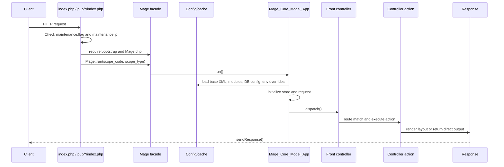
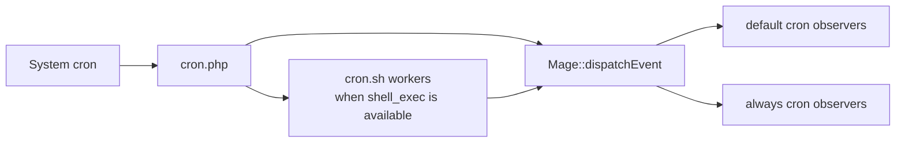
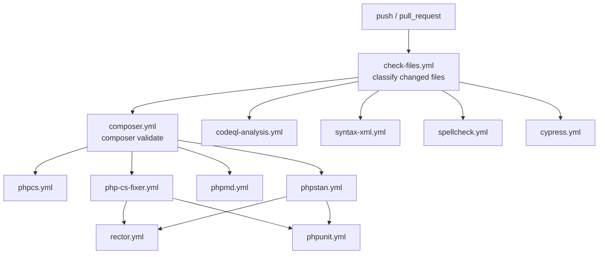

# Workflows

This document summarizes the main local, runtime, test, documentation, and CI workflows exposed by the repository.

## Local Setup

The basic dependency setup is Composer-based:

```bash
composer install
```

The console installer is `install.php`. It can print valid install options:

```bash
php -f install.php -- --get_options
```

It can also perform a full install:

```bash
php -f install.php -- \
  --license_agreement_accepted yes \
  --locale en_US \
  --timezone America/New_York \
  --default_currency USD \
  --db_host 127.0.0.1 \
  --db_name db \
  --db_user root \
  --db_pass root \
  --url http://openmage.local \
  --use_rewrites yes \
  --skip_url_validation yes \
  --admin_username admin \
  --admin_lastname Administrator \
  --admin_firstname OpenMage \
  --admin_email admin@example.com \
  --admin_password veryl0ngpassw0rd \
  --session_save files
```

For containerized development, the repository also documents two supported paths:

- DDEV, through `docs/content/developers/tools/ddev.md`.
- Docker Compose, through `docs/content/developers/tools/oneline.md` and files in `dev/openmage/`.

## Web Request Lifecycle



Key runtime switches:

- `MAGE_RUN_CODE` chooses the website, store group, or store code.
- `MAGE_RUN_TYPE` defaults to `store`.
- `MAGE_IS_DEVELOPER_MODE=1` enables developer mode and visible errors.
- `maintenance.flag` enables maintenance mode.
- `maintenance.ip` allows selected remote IPs to bypass maintenance mode.

## API Workflow

`api.php` is a separate endpoint. It loads the admin application scope, loads global and adminhtml event areas, then chooses the API server:

- If the request `type` matches an API2 type, it runs `Mage_Api2_Model_Server`.
- Otherwise it initializes `Mage_Api_Model_Server` with the adapter alias or default adapter.

## Media Fallback Workflow

`get.php` exists for database-backed media storage fallback. It:

1. Loads a cached `var/resource_config.json` if available.
2. Validates the requested path against the configured media directory and allowed resources.
3. Initializes only the needed modules when a resource config cache is available.
4. Checks whether database file storage is enabled.
5. Pulls the file from database storage into local storage when needed.
6. Sends the local file or a 404.

## Cron Workflow

`cron.php` is the OpenMage cron entry. It initializes the admin store, then either:

- Spawns `cron.sh` twice for `default` and `always` modes when shell execution is available.
- Dispatches both event groups in-process when shell execution is unavailable.
- Dispatches one group when called with `-mdefault` or `-malways`.

The effective work is event-driven:



## Shell Script Workflow

CLI scripts under `shell/` extend `Mage_Shell_Abstract`. The base class:

- Loads `app/Mage.php`.
- Initializes `Mage::app('admin', 'store')` by default.
- Reads PHP settings from `.htaccess`.
- Parses `--option value`, `-x value`, and positional arguments.
- Blocks browser execution by checking `$_SERVER['REQUEST_METHOD']`.

## Environment Configuration Workflow

The environment override feature is loaded by `Mage_Core_Helper_EnvironmentConfigLoader` after DB config:

```ini
MAGE_IS_DEVELOPER_MODE=1
OPENMAGE_CONFIG_OVERRIDE_ALLOWED=1
OPENMAGE_CONFIG__DEFAULT__GENERAL__STORE_INFORMATION__NAME="My OpenMage Store"
OPENMAGE_CONFIG__WEBSITES__BASE__GENERAL__STORE_INFORMATION__PHONE="123"
OPENMAGE_CONFIG__STORES__GERMAN__GENERAL__STORE_INFORMATION__ADDRESS="Berlin"
```

The key format is:

```text
OPENMAGE_CONFIG__<SCOPE>__<SECTION>__<GROUP>__<FIELD>
```

Supported scopes are `DEFAULT`, `WEBSITES__<website_code>`, and `STORES__<store_code>`.

## Development Commands

Composer scripts define the main local checks:

| Task | Command |
| --- | --- |
| Run the default quality gate | `composer run test` |
| Coding style check | `composer run php-cs-fixer:test` |
| Apply coding style fixes | `composer run php-cs-fixer:fix` |
| PHPStan | `composer run phpstan:test` |
| Update PHPStan baseline | `composer run phpstan:baseline` |
| PHPUnit | `composer run phpunit:test` |
| PHPUnit with coverage output | `composer run phpunit:coverage-local` |
| PHPMD | `composer run phpmd:test` |
| Update PHPMD baseline | `composer run phpmd:baseline` |
| Rector dry run | `composer run rector:test` |
| Apply Rector changes | `composer run rector:fix` |
| Generate vendor patches | `composer run vendor:patch` |

Makefile helpers open generated reports or serve docs:

| Task | Command |
| --- | --- |
| Serve MkDocs | `make mkdocs-serve` |
| Open PHPUnit coverage report | `make phpunit-serve` |
| Open PHPMD report | `make phpmd-serve` |

## Test Workflows

### PHPUnit

The main PHPUnit config is `.phpunit.dist.xml`.

- Bootstrap: `tests/bootstrap.php`.
- Developer mode: enabled through `MAGE_IS_DEVELOPER_MODE=1`.
- Result cache: `.cache/.phpunit.result.cache`.
- Reports: `build/phpunit`.
- Suites are split by module, with focused base suites named `Base`, `Error`, `Mage`, and `Varien`.

CI installs OpenMage against MySQL before running PHPUnit. The current matrix tests PHP `8.1` and `8.5` against MySQL `5.7`, `8.0`, and `8.4`.

### Cypress

Cypress specs live under `cypress/e2e` and `.cypress.config.js` points to:

```text
https://magento-lts.ddev.site
```

CI provisions DDEV, installs OpenMage, adds the DDEV Cypress add-on, starts DDEV, and runs:

```bash
ddev cypress-run --config-file .cypress.config.js
```

## Documentation Workflow

MkDocs is configured by `mkdocs.yml`.

- Documentation source: `docs/content`.
- Theme: Material for MkDocs.
- Shared snippets: `docs_includes/abbreviations.md`.
- Local server: `make mkdocs-serve` or `mkdocs serve`.
- Build command: `mkdocs build`.

The GitHub `MkDocs` workflow deploys docs on pushes to `main` or `documentation` that affect documentation paths or `mkdocs.yml`.

## CI Workflow

The main CI entry point is `.github/workflows/workflow.yml`. It runs on pushes and pull requests that affect PHP, PHTML, JS, Markdown, XML, Composer, and workflow files.



Conditional execution is based on the file categories emitted by `check-files.yml`, so most expensive jobs run only when related files changed. Some workflows also run on schedule or manual dispatch:

- PHP syntax and XML syntax have scheduled validation workflows.
- PHPUnit runs weekly and can be called by CI or manually.
- Security checks run on schedule, pull requests, and manual dispatch.
- Release Drafter updates draft releases on pushes to the main branch.

## Modernization Tooling Gaps

This repository is not yet a Laravel application. The current checkout has no `artisan`, no Laravel application skeleton, no `package.json`, no Vite config, no Pest config, no Pint config, and no Laravel-specific CI job.

Before Laravel implementation work is considered ready, add explicit gates for:

- Laravel bootstrap smoke test.
- Laravel/PHPUnit or Pest test command.
- Larastan/PHPStan configuration for new Laravel code.
- Pint or agreed Laravel style command.
- Vite or frontend asset build once Livewire assets require it.
- Route, config, event, queue, scheduler, and cache diagnostics.
- No-new-XML architecture test.
- Composer validate, syntax checks, static analysis, PHPUnit, browser tests, security checks, docs build, and modernization-specific gates in one required workflow.

Known current gaps:

- `composer test` runs only ECS/PHP-CS-Fixer, PHPStan, and PHPUnit. It does not include PHPCS, PHPMD, Rector, Cypress, Composer validation, syntax checks, security checks, or docs checks.
- Cypress has no repo-local Node dependency manifest; CI currently relies on the DDEV Cypress add-on.
- Static-analysis/style workflows are not fully matrixed across all supported PHP versions.
- PHP version usage is mixed across contexts: Composer platform `8.1`, PHPUnit CI `8.1` and `8.5`, Cypress DDEV `8.3`, and Docker Compose OpenMage images using PHP `8.2`.
- No coverage threshold, mutation threshold, or modernization debt policy is enforced yet.

## Legacy Module Change Workflow

When changing legacy Magento module behavior before it is migrated, follow the Magento 1 flow already used by core modules:

1. Declare activation and dependencies in `app/etc/modules/<Vendor_Module>.xml`.
2. Add or update module configuration in `<code_pool>/<Vendor>/<Module>/etc/config.xml`.
3. Put PHP classes under `Block`, `Helper`, `Model`, `Model/Resource`, `controllers`, or module-specific folders.
4. Add setup changes under `sql/<resource_name>` or `data/<resource_name>` when persistence changes.
5. Add or update layout XML/templates in `app/design` and static assets in `skin` or `js` when UI changes.
6. Cover behavior with PHPUnit tests under `tests/unit` or browser coverage under `cypress/e2e` when the change affects user-visible flows.
7. Run the narrow check first, then the broader Composer quality gate before opening a pull request.

New Laravel modernization modules must instead follow the no-XML module system described in `specs/modernization/architecture-specs.md`.
