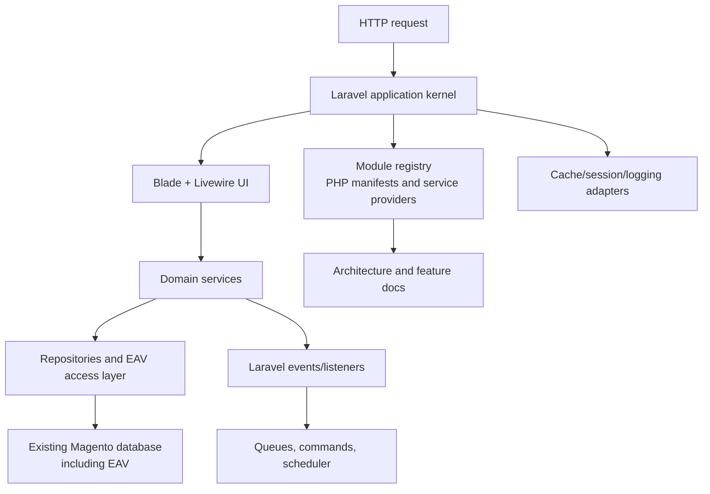

# Laravel Modernization Roadmap

This roadmap describes how to modernize the current Magento 1 codebase into a Laravel-based architecture while preserving the existing database schema, EAV model, storefront look and feel, and admin look and feel. It should be read together with the [test plan](test-plan.md), which defines the completion gate.

The target is not a cosmetic Laravel wrapper around Magento. The target is a modular Laravel application with modern PHP patterns, Livewire-powered UI surfaces, clean extension points, and no XML-based configuration for new architecture.

The current repository scan is source-only. The local smoke baseline is Magento CE `1.9.4.5`. Before implementation starts, repeat the [inventory](inventory.md) against the actual project overlay, database, media, integrations, and deployment configuration.

## Target Outcomes

- Replace Zend/Magento framework runtime with Laravel runtime and Laravel/Symfony components.
- Use Livewire for interactive admin and storefront UI implementation.
- Keep the existing database schema, including EAV tables and existing seed/original data.
- Preserve storefront and admin look and feel during migration.
- Preserve business behavior unless a change is explicitly specified.
- Replace XML configuration for new code with PHP-based module manifests, service providers, attributes, config arrays, and typed contracts.
- Provide a documentation website that explains the new architecture, the reasoning behind it, and a full feature guide.
- Keep the project deployable and testable throughout the migration.
- Upgrade the Laravel target runtime to the latest stable PHP, currently PHP `8.5.x` as of 2026-05-18.

## Guiding Principles

1. Preserve behavior first. Architecture changes must not silently change commerce behavior.
2. Migrate by bounded context. Do not rewrite catalog, checkout, admin, API, and sales at once.
3. Keep the database stable. Existing commerce tables, including EAV, remain the source of truth.
4. Build replacement contracts before replacing implementations.
5. Add characterization tests before touching high-risk behavior.
6. Prefer Laravel conventions for new code, but do not force Eloquent into places where Magento EAV behavior would be lost.
7. New extensibility must be code-based, discoverable, versionable, and testable. No new XML configuration.
8. Visual parity is a requirement, not a later polish task.

## Scope Decisions

| Area | Decision |
| --- | --- |
| Framework | Replace Zend/Magento runtime with Laravel. |
| ORM | Use Eloquent where it fits, with custom EAV repositories/query builders where needed. |
| Database | Keep existing schema and data, including EAV and original seed data. |
| Storefront UI | Rebuild with Laravel Blade and Livewire while preserving current look and feel. |
| Admin UI | Rebuild with Laravel Blade and Livewire while preserving current look and feel. |
| Configuration | New architecture must not use XML. |
| Extensions/modules | Replace Magento XML modules with Laravel-style modules/packages. |
| APIs | Preserve existing public behavior during migration, then expose modern Laravel APIs where specified. |
| Documentation | Build architecture and feature documentation into the docs website. |

## Non-Functional Requirements

| Requirement | Acceptance Criteria | Verification |
| --- | --- | --- |
| Database compatibility | Existing database loads without destructive schema migration. Existing EAV data resolves correctly. Original seed/sample data remains usable. | Run install/import fixture, boot app, compare record counts for core entity tables, execute catalog/customer/order smoke tests. |
| No XML for new architecture | No new feature, module, route, event, UI, or config registration uses XML. Existing XML may be read only by compatibility tooling during transition. | Static search for new XML additions, architecture review, tests proving PHP manifests/providers register modules. |
| Visual parity | Storefront and admin screens match current layout, typography, spacing, colors, and interaction patterns within agreed tolerance. | Playwright/Cypress screenshots, visual regression snapshots, manual review checklist per screen. |
| Behavior parity | Existing customer, catalog, cart, checkout, order, admin, API, cron, and indexer behavior remains compatible unless intentionally changed. | Characterization tests, API contract tests, fixture-based PHPUnit tests, E2E regression suite. |
| Performance | New Laravel paths are no slower than current Magento paths for equivalent cached and uncached scenarios, or have documented exceptions. | Baseline and compare p50/p95 response times, query counts, memory usage, cache hit behavior. |
| PHP runtime | Legacy Magento verification may use an isolated PHP `7.4` container, but all Laravel target code runs on the latest stable PHP and CI enforces that version. | `php -v`, Composer platform checks, CI matrix, dependency audit, Laravel Boost install check. |
| Code quality | New code uses typed PHP, Laravel conventions, dependency injection, tests, static analysis, and clear module boundaries. | PHPStan/Larastan at agreed level, Pint/PHP-CS-Fixer, Rector where appropriate, code review checklist. |
| Maintainability | New domains expose services, contracts, events, policies, and feature documentation. Runtime behavior is inspectable without reading XML. | Architecture docs, generated module registry report, dependency graph review. |
| Extensibility | New modules can register services, routes, commands, events, Livewire components, views, policies, and config without modifying core. | Build a sample module, run integration tests, verify install/uninstall and enable/disable behavior. |
| Security | Authentication, authorization, CSRF, session handling, file access, and admin routes meet Laravel and commerce security expectations. | Security test suite, dependency audit, permission tests, admin ACL tests, file/media access tests. |
| Operational stability | Cron, cache, sessions, logging, configuration, and deployments remain predictable during transition. | Deployment rehearsal, cache/session tests, cron schedule tests, logging assertions, rollback test. |
| Documentation completeness | Architecture website explains target architecture, module system, EAV access, UI patterns, extension guide, and migration status. | MkDocs build, docs review checklist, link check. |

## Target Architecture

## Legacy To Laravel Mapping

| Current Magento Concept | Target Laravel Concept |
| --- | --- |
| `Mage::app()` | Laravel application container and bootstrappers |
| `Mage::run()` | Laravel HTTP kernel |
| `Mage::getModel()` | Container-bound services, repositories, Eloquent models where safe |
| `Mage::helper()` | Services, helpers only where stateless and tested |
| Resource models | Repositories, query builders, EAV access layer, Eloquent for flat entities |
| Collections | Typed query objects, Eloquent builders, paginated DTO collections |
| XML module declarations | PHP module manifests and service providers |
| XML config tree | Laravel config repository and typed config objects |
| Magento events/observers | Laravel events/listeners, subscribers, queued listeners |
| Layout XML | Blade layouts, components, Livewire components, view composers |
| Blocks | View models, Blade components, Livewire components |
| Admin ACL XML | Laravel gates, policies, permissions, module-provided permission manifests |
| `cron.php` | Laravel scheduler and Artisan commands |
| Shell scripts | Artisan commands |
| Setup scripts | No destructive DB migration for existing schema; optional module installers only with explicit approval |
| API controllers | Laravel controllers/resources while preserving legacy contracts where required |

## Phase 0: Workspace And Baseline Inventory

Goal: assemble a complete local source of truth before modernization starts.

### Tasks

1. Check out the current project code locally.
2. Check out Magento CE `1.9.4.5` source locally.
3. Record how project code overlays core code: `app/code/local`, `app/code/community`, theme files, `skin`, `js`, `media`, config, and patches.
4. Capture current dependency state from `composer.json`, `composer.lock`, vendor patches, PHP version, extensions, and web server config.
5. Define the Laravel target PHP version as the latest stable PHP and record the exact patch release in CI.
6. Capture a sanitized database dump containing schema and original seed/sample data.
7. Capture media fixtures needed for visual and functional tests.
8. Document all active modules, observers, routes, admin pages, cron jobs, API endpoints, setup scripts, and theme overrides.
9. Identify custom code that depends on Zend, Varien, or Magento static APIs.
10. Create a migration decision log.

### Dependencies

- Access to project repository and Magento CE `1.9.4.5` source repository.
- Access to a representative database and media set.
- Legacy PHP runtime for Magento smoke testing plus latest stable PHP, Composer, web server, and database runtime for Laravel preparation.

### Verification

- Fresh local install boots from the captured code and database.
- Storefront, admin, cron, and APIs are reachable locally.
- Inventory document lists every active module and custom override.
- `composer install` is reproducible from the lockfile.
- Latest stable PHP is available in local tooling and CI for the Laravel target.

## Phase 1: Characterization Tests

Goal: freeze current behavior before replacing architecture.

### Tasks

1. Audit existing PHPUnit and Cypress coverage.
2. Add missing functional tests for storefront home, category, product, search, cart, checkout, customer login/account, and CMS pages.
3. Add missing admin tests for login, dashboard, catalog CRUD, customer CRUD, order view, invoice, shipment, credit memo, configuration, cache, indexer, and permissions.
4. Add API contract tests for REST, JSON-RPC, SOAP if used, and API2 endpoints.
5. Add cron tests for scheduled jobs, dispatch modes, and failure handling.
6. Add EAV tests for product, category, customer, attribute scope, default/website/store fallback, and option values.
7. Add configuration tests for XML + DB + environment override behavior.
8. Add media fallback tests for local and database-backed media storage.
9. Add visual regression snapshots for key storefront and admin screens.
10. Add performance baseline scripts for selected pages and workflows.

### Dependencies

- Phase 0 local runtime.
- Stable fixtures and seed data.
- Browser test runtime.

### Verification

- Test suite runs locally and in CI.
- Visual snapshots are stored and reviewed.
- Baseline performance numbers are recorded.
- Each high-risk domain has at least one failing test when its behavior is intentionally broken.

## Phase 2: Modernization Specifications

Goal: create complete implementation specs before replacing framework internals.

### Tasks

1. Write the Laravel target architecture spec.
2. Write the module system spec.
3. Write the no-XML configuration spec.
4. Write the EAV access layer spec.
5. Write the UI architecture spec for Blade and Livewire.
6. Write the admin architecture spec.
7. Write the storefront architecture spec.
8. Write the routing and URL compatibility spec.
9. Write the event/listener compatibility and replacement spec.
10. Write the cache/session/logging/filesystem spec.
11. Write the authentication, authorization, and admin permission spec.
12. Write the API compatibility spec.
13. Write the cron/scheduler and command spec.
14. Write the testing strategy and acceptance matrix.
15. Write the [comprehensive test plan](test-plan.md) used to decide when the modernization is done.
16. Write the rollout and rollback strategy.
17. Convert all specs into a phased task list with dependencies, owners, acceptance criteria, and verification commands.

### Dependencies

- Phase 0 inventory.
- Phase 1 behavior tests and baseline data.

### Verification

- Specs are reviewed and approved before implementation.
- Every modernization task references a spec section.
- Every task has explicit verification steps.
- Risk register covers checkout, sales, EAV, admin permissions, pricing, tax, inventory, payments, and extension compatibility.

## Phase 3: Laravel Foundation Beside Legacy Runtime

Goal: introduce Laravel infrastructure without changing user-visible behavior.

### Tasks

1. Add Laravel framework dependencies or create a new Laravel app shell in the repository.
2. Bootstrap Laravel container from the existing entry point without taking over routing.
3. Bind core infrastructure contracts: config, database, cache, session, logging, events, filesystem, URL generation, auth, and translation.
4. Add Laravel service providers for new architecture.
5. Add a module registry based on PHP manifests.
6. Add typed configuration objects backed by Laravel config.
7. Add compatibility adapters that can call legacy Magento services where needed.
8. Add health checks for Laravel bootstrap, database, cache, session, and module registry.
9. Add CI jobs for Laravel test, Pint or style tooling, Larastan/PHPStan config, and architecture tests.

### Dependencies

- Phase 2 architecture specs.
- Current Composer dependency constraints reviewed for conflicts.

### Verification

- Legacy storefront/admin behavior remains unchanged.
- Laravel container boots during requests and CLI.
- A smoke test can resolve a Laravel service from the container.
- No new XML files are introduced.
- CI runs both legacy and Laravel checks.

## Phase 4: Database And EAV Access Layer

Goal: make the existing database usable from Laravel without schema migration.

### Tasks

1. Configure Laravel database connections for the existing Magento database.
2. Define a database ownership policy: existing commerce tables are preserved.
3. Create read-only Eloquent models for flat tables where safe, such as stores, websites, config, and selected sales/reference tables.
4. Create a dedicated EAV metadata service for entity types, attributes, backend tables, options, scope, and fallback.
5. Create EAV query builders for products, categories, customers, and addresses.
6. Create repositories that hide EAV complexity from application services.
7. Implement store-scope resolution matching Magento behavior.
8. Implement config resolution matching default/website/store fallback.
9. Add transaction and locking policies for write operations.
10. Add fixtures and factories that use the existing schema.

### Dependencies

- Laravel foundation.
- EAV and config specs.
- Representative database.

### Verification

- EAV tests from Phase 1 pass against Laravel repositories.
- Product/category/customer reads match legacy output for fixture entities.
- Query counts and response times are recorded.
- Existing tables are not changed by the Laravel boot process.

## Phase 5: Module System Without XML

Goal: replace Magento XML module registration with PHP-based modular architecture for all new code.

### Tasks

1. Define module package layout.
2. Define `module.php` or equivalent PHP manifest format.
3. Support module metadata: name, version, dependencies, service providers, routes, commands, events, permissions, views, assets, config, and feature flags.
4. Implement dependency ordering and cycle detection.
5. Implement module enable/disable behavior.
6. Implement module discovery for local modules and Composer packages.
7. Implement module-provided routes, Livewire components, Blade views, commands, event listeners, policies, and config.
8. Implement module diagnostics command.
9. Create a sample module that exercises every extension point.
10. Document module authoring rules.

### Dependencies

- Laravel foundation.
- No-XML spec.

### Verification

- Sample module installs and boots without XML.
- Module dependency ordering is tested.
- Disabled modules do not register routes/services/listeners.
- Static check fails on new XML registration files.
- Documentation includes a complete module authoring guide.

## Phase 6: HTTP Routing And Compatibility Layer

Goal: let Laravel handle selected routes while legacy Magento continues to handle unmigrated routes.

### Tasks

1. Define route ownership rules.
2. Add Laravel HTTP kernel entry path.
3. Implement route fallback from Laravel to legacy Magento for unmigrated routes.
4. Preserve existing frontend and admin URLs.
5. Preserve store code and website scope detection.
6. Preserve URL rewrites and request rewrite behavior.
7. Preserve maintenance mode semantics or provide documented replacement with parity.
8. Add route-level metrics and logging.
9. Add feature flags for moving route groups from legacy to Laravel.

### Dependencies

- Laravel foundation.
- EAV/config access layer.
- Characterization tests.

### Verification

- Existing URLs continue to work.
- Migrated Laravel routes pass the same tests as legacy routes.
- Unmigrated routes fall back to legacy.
- Store scope tests pass.
- Admin URL/frontname compatibility tests pass.

## Phase 7: Storefront UI With Blade And Livewire

Goal: rebuild storefront surfaces in Laravel while preserving current look and feel.

### Tasks

1. Inventory all active storefront layouts, templates, blocks, widgets, and static assets.
2. Create Blade layout equivalents for page shell, head assets, header, navigation, footer, messages, breadcrumbs, and content regions.
3. Create Livewire components for dynamic storefront interactions.
4. Rebuild CMS page rendering.
5. Rebuild category page rendering.
6. Rebuild product page rendering.
7. Rebuild search results.
8. Rebuild customer account screens.
9. Rebuild cart interactions.
10. Rebuild checkout only after catalog, customer, and cart foundations are stable.
11. Preserve theme CSS and visual assets where possible.
12. Replace Magento blocks with view models, Blade components, and Livewire components.
13. Add visual regression coverage per migrated page.

### Dependencies

- Laravel routing compatibility.
- EAV catalog repositories.
- Customer/session/auth architecture.
- Storefront UI spec.

### Verification

- Migrated pages match visual baselines.
- Existing storefront Cypress tests pass.
- Livewire interactions are tested.
- Page performance is equal or better than baseline.
- No layout XML is used for new storefront surfaces.

## Phase 8: Admin UI With Blade And Livewire

Goal: rebuild admin screens in Laravel and Livewire while preserving current admin look and feel.

### Tasks

1. Inventory admin routes, controllers, grids, forms, ACL rules, blocks, templates, and assets.
2. Implement Laravel admin authentication.
3. Implement admin authorization using gates/policies/permissions.
4. Create admin shell layout matching current admin look and feel.
5. Build reusable Livewire grid component with filters, sorting, pagination, mass actions, export, and row actions.
6. Build reusable form components with validation, tabs, fieldsets, file uploads, and store-scope fields.
7. Rebuild dashboard.
8. Rebuild cache management.
9. Rebuild system configuration.
10. Rebuild catalog product and category admin.
11. Rebuild customer admin.
12. Rebuild order, invoice, shipment, and credit memo admin views.
13. Rebuild permissions/roles/users.
14. Rebuild indexer admin.
15. Add admin visual regression coverage.

### Dependencies

- Laravel foundation.
- Admin architecture spec.
- Auth/authorization spec.
- EAV and sales repositories.

### Verification

- Admin tests pass for migrated screens.
- Permission tests prove unauthorized users cannot access actions.
- Visual snapshots match current admin.
- No new admin XML config is used.
- Admin grids/forms meet performance thresholds on representative data.

## Phase 9: Domain Services

Goal: move business behavior out of static Magento patterns into explicit services.

### Tasks

1. Define service contracts and DTOs for each bounded context.
2. Implement catalog services for products, categories, attributes, pricing display, media, and search.
3. Implement customer services for accounts, addresses, sessions, passwords, and groups.
4. Implement cart services for quotes, items, totals, coupons, shipping rates, and payment selection.
5. Implement checkout services.
6. Implement sales services for orders, invoices, shipments, credit memos, refunds, emails, and comments.
7. Implement tax, shipping, payment, inventory, and promotion services.
8. Implement CMS, newsletter, reports, sitemap, and search services.
9. Replace legacy callers gradually with service calls.
10. Add domain-level contract tests.

### Dependencies

- EAV access layer.
- Config and store scope services.
- Event system.
- Tests for each bounded context.

### Verification

- Domain service tests pass.
- Legacy and Laravel results match for fixtures.
- High-risk workflows have E2E coverage.
- Services do not depend on `Mage::getModel()` or XML config.

## Phase 10: Events, Jobs, Cron, And Commands

Goal: replace observers, cron, and shell scripts with Laravel events, scheduler, queues, and Artisan commands.

### Tasks

1. Inventory all Magento events and observers currently used.
2. Map legacy event names to new Laravel event classes.
3. Add event compatibility bridge for unmigrated code.
4. Replace cron dispatch with Laravel scheduler entries.
5. Replace shell scripts with Artisan commands.
6. Define queue policy: sync, database, Redis, or external queue. Do not require commerce schema changes unless approved.
7. Implement failure logging and retry policy.
8. Implement schedule diagnostics.
9. Add tests for event ordering and listener side effects.

### Dependencies

- Laravel foundation.
- Module system.
- Domain services.

### Verification

- Existing cron behavior is reproduced.
- `php artisan schedule:list` shows expected tasks.
- Commands have tests and documented usage.
- Event compatibility tests pass.
- No new XML observer configuration is used.

## Phase 11: APIs

Goal: preserve existing API behavior while adding Laravel-native API implementation.

### Tasks

1. Inventory REST, JSON-RPC, SOAP, and API2 endpoints in use.
2. Define required compatibility behavior.
3. Implement Laravel route groups for migrated endpoints.
4. Implement request validation and response resources.
5. Preserve authentication and authorization behavior where compatibility is required.
6. Add API versioning strategy for modern endpoints.
7. Add OpenAPI documentation for modern APIs.
8. Keep fallback to legacy API handlers for unmigrated endpoints.

### Dependencies

- Laravel routing.
- Domain services.
- Auth/authorization.
- API compatibility spec.

### Verification

- API contract tests pass.
- Legacy clients continue to work where compatibility is required.
- OpenAPI docs build successfully.
- Error formats and status codes match the compatibility spec.

## Phase 12: Legacy Framework Retirement

Goal: remove Zend/Magento framework dependencies from migrated runtime paths.

### Tasks

1. Track all remaining runtime references to Zend, Varien, `Mage::`, XML config, blocks, resource models, and legacy controllers.
2. Replace remaining high-value paths with Laravel services.
3. Remove route fallbacks once equivalent Laravel routes are complete.
4. Remove compatibility adapters module by module.
5. Replace legacy cache/session/logging adapters where safe.
6. Remove unused legacy libraries after dependency analysis.
7. Keep an explicit compatibility package only for code that must remain supported.
8. Update documentation and upgrade guides.

### Dependencies

- All migrated domains verified.
- Rollback strategy proven.

### Verification

- Runtime route coverage shows no traffic hitting retired legacy paths.
- Static analysis confirms removed dependencies are unused.
- Full regression suite passes.
- Performance baselines remain acceptable.
- Deployment rollback has been tested.

## Phase 13: Documentation Website And Feature Guide

Goal: publish complete documentation for the new architecture and user-facing features.

### Tasks

1. Add a modernization documentation section to the MkDocs site.
2. Document architecture overview and design reasoning.
3. Document module authoring.
4. Document no-XML configuration.
5. Document database and EAV access.
6. Document storefront UI patterns.
7. Document admin UI patterns.
8. Document events, jobs, commands, and scheduler.
9. Document testing and verification strategy.
10. Document deployment, rollback, and operations.
11. Document full feature guide for storefront, admin, APIs, and extension points.
12. Add migration status pages per bounded context.
13. Add diagrams for runtime, modules, EAV access, request lifecycle, and deployment.

### Dependencies

- Specs and implementation phases.
- MkDocs tooling.

### Verification

- `mkdocs build` succeeds.
- Links and navigation are reviewed.
- Each implemented feature has user-facing and developer-facing documentation.
- Architecture reasoning is clear enough for a new contributor to build a module.

## Phase 14: Release And Cutover

Goal: release the Laravel architecture safely.

### Tasks

1. Define release criteria.
2. Freeze legacy behavior changes before final cutover.
3. Run full functional, visual, API, performance, security, and accessibility checks.
4. Run database backup and restore rehearsal.
5. Run deployment rehearsal in staging.
6. Verify logs, metrics, health checks, queues, scheduler, cache, sessions, and file storage.
7. Prepare rollback plan.
8. Prepare operator runbook.
9. Prepare developer upgrade guide.
10. Cut over route groups or full application according to rollout plan.
11. Monitor errors, latency, conversion funnels, admin workflows, cron, and queue failures.

### Dependencies

- All required domains migrated.
- All acceptance criteria met.
- Stakeholder approval.

### Verification

- Release checklist signed off.
- Staging deployment passes smoke and regression tests.
- Production rollback path is tested.
- Monitoring shows no critical regressions after cutover.

## Suggested First Implementation Milestones

1. Create complete local project/core inventory and fixture database.
2. Add missing characterization tests around catalog, cart, checkout, admin, API, cron, config, and EAV.
3. Write the modernization specs and acceptance matrix.
4. Bootstrap Laravel beside the existing runtime without behavior changes.
5. Implement Laravel config, container, events, logging, cache, and DB access contracts.
6. Implement read-only EAV catalog repositories.
7. Build a sample no-XML Laravel module.
8. Migrate one low-risk admin utility screen with Livewire.
9. Migrate one low-risk storefront page with Blade and Livewire.
10. Use the results to refine the full task list before touching checkout and sales.

## High-Risk Areas

| Area | Risk | Mitigation |
| --- | --- | --- |
| EAV | Store-scope fallback, attribute backend types, option labels, and indexing behavior are easy to break. | Dedicated EAV service, fixture tests, parity tests against legacy reads. |
| Checkout | Totals, tax, shipping, payment, coupons, sessions, and quote mutation are tightly coupled. | Migrate late, add extensive E2E and service tests. |
| Sales | Order lifecycle side effects affect invoices, shipments, credit memos, emails, inventory, and payment captures. | Service contracts, event tests, transaction policy, fixture replay tests. |
| Admin ACL | Magento ACL and admin routes are XML-driven today. | Permission manifest spec, policy tests, admin E2E coverage. |
| Layout/theme parity | Blocks and layout XML may contain hidden behavior. | Template inventory, visual regression, view model mapping. |
| Extension compatibility | Existing modules may depend on static APIs and XML config. | Module inventory, compatibility bridge, sample migrated module, deprecation plan. |
| Performance | Laravel/Eloquent can add queries if EAV is modeled naively. | Query builders, eager loading rules, query count tests, profiling. |
| Data writes | Keeping schema avoids migration but not write semantics. | Repository write tests, transaction policy, legacy parity tests. |

## Required Deliverables

- Local workspace inventory.
- Database and media fixture strategy.
- Characterization test suite.
- Comprehensive modernization test plan.
- Modernization specs.
- Non-functional requirements matrix.
- Laravel foundation package/app.
- No-XML module system.
- EAV access layer.
- Storefront Blade/Livewire implementation.
- Admin Blade/Livewire implementation.
- Domain services.
- API compatibility layer and modern API docs.
- Scheduler/command/event replacement.
- Documentation website with architecture reasoning and feature guide.
- Release, rollback, and operations runbook.
