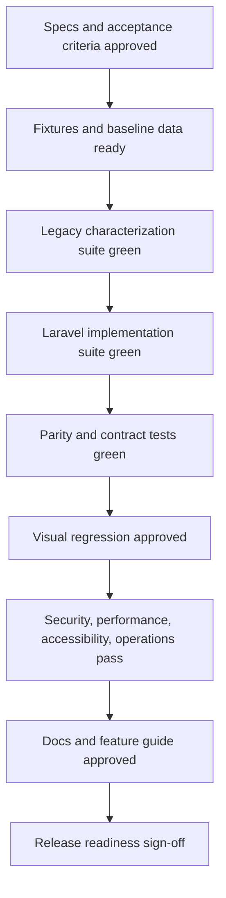

# Modernization Test Plan

This test plan defines how to prove the Laravel modernization is complete. It is intended to be used as the final completion gate for replacing the Magento/OpenMage framework runtime with Laravel while preserving database schema, EAV behavior, storefront/admin look and feel, and business behavior.

The project is not done when the code compiles. It is done when this plan passes with agreed evidence.

## Test Objectives

1. Prove behavior parity between the current OpenMage runtime and the Laravel runtime.
2. Prove the existing database schema and original seed/sample data work without destructive migration.
3. Prove EAV reads and writes preserve Magento semantics.
4. Prove storefront and admin visual parity.
5. Prove the new Laravel and Livewire architecture is modular, extensible, and free of new XML configuration.
6. Prove security, performance, reliability, accessibility, and operational behavior are production-ready.
7. Prove documentation is complete enough for users, operators, and module developers.

## Done Definition

The modernization is done only when all of the following are true:

- All required automated test suites pass in CI.
- All required manual acceptance scenarios are signed off.
- All P0 and P1 defects are closed.
- No P2 defect is open without explicit acceptance.
- Storefront and admin visual regression results are within the agreed tolerance.
- Performance budgets pass for all critical journeys.
- Security checks pass with no unresolved critical/high findings.
- Existing database schema and EAV data are used without destructive migration.
- No new architecture feature uses XML registration/configuration.
- Documentation website builds and covers architecture, reasoning, extension points, and feature guides.
- Rollback and recovery procedures have been tested.

## Quality Gates

## Test Environments

| Environment | Purpose | Required Data | Gate |
| --- | --- | --- | --- |
| Local developer | Fast feedback and focused implementation checks. | Minimal fixtures plus selected domain fixtures. | Required before PR. |
| CI | Deterministic automated validation. | Versioned fixture database and media fixtures. | Required for merge. |
| Staging parity | Full end-to-end validation against representative data. | Sanitized production-like database, media, config, and integrations in sandbox mode. | Required before release. |
| Production shadow or canary | Real traffic confidence where applicable. | Production data, read-only or limited-route rollout. | Required for final cutover if available. |

## Test Data Strategy

### Required Fixture Sets

| Fixture Set | Purpose | Contents |
| --- | --- | --- |
| Minimal install fixture | Fast baseline checks. | Fresh OpenMage install with default store, admin user, base config. |
| Original seed/sample fixture | Proves existing seed/sample data compatibility. | Original sample catalog, categories, customers if available, orders if available, media. |
| EAV edge fixture | Proves EAV semantics. | Attributes of every backend type, scoped values, options, multiselects, required fields, custom attributes, disabled attributes. |
| Multistore fixture | Proves scope and URL behavior. | Multiple websites, store groups, store views, languages, currencies, store-specific config and attributes. |
| Sales lifecycle fixture | Proves order behavior. | Quotes, orders, invoices, shipments, credit memos, refunds, comments, emails, payment states. |
| Admin permissions fixture | Proves admin ACL replacement. | Roles with full, partial, and no permissions across core admin areas. |
| Integration fixture | Proves API and external behavior. | API users, OAuth/REST credentials if used, sandbox payment/shipping settings. |
| Performance fixture | Proves scale behavior. | Large catalog, many attributes, many categories, many customers, meaningful order history. |

### Data Rules

- Existing commerce schema must not be destructively altered.
- Test setup may create data using existing schema only.
- Any new infrastructure table requires explicit approval and must not be required for preserving the existing commerce database.
- Fixtures must be reproducible from versioned scripts or documented dumps.
- Sensitive production data must be sanitized before use outside production.

## Test Layers

| Layer | Purpose | Tools |
| --- | --- | --- |
| Static checks | Enforce code quality, types, architecture boundaries, and no-new-XML rule. | PHPStan/Larastan, PHP-CS-Fixer/Pint, PHPCS, Rector dry run, custom architecture tests. |
| Unit tests | Prove isolated services, value objects, DTOs, mappers, validators, and policies. | PHPUnit/Pest if adopted. |
| Integration tests | Prove database, EAV, cache, session, filesystem, config, events, queues, and services together. | PHPUnit with fixture DB. |
| Contract tests | Prove compatibility of APIs, events, repositories, and module extension points. | PHPUnit, HTTP contract tests, snapshot assertions. |
| Characterization tests | Prove Laravel behavior matches legacy OpenMage behavior. | Dual-run tests against legacy and Laravel paths. |
| Livewire component tests | Prove component state, validation, actions, events, and rendering. | Livewire test utilities. |
| Browser E2E tests | Prove user journeys. | Cypress or Playwright. |
| Visual regression | Prove storefront/admin look and feel is preserved. | Playwright/Cypress screenshots and image diff tooling. |
| Accessibility tests | Prove keyboard, semantics, contrast, and admin usability. | Axe, Playwright, manual keyboard checks. |
| Performance tests | Prove latency, query counts, memory, throughput, and cache behavior. | k6, Blackfire/XHProf/SPX, custom query counters. |
| Security tests | Prove auth, authorization, CSRF, sessions, uploads, file access, dependency safety. | PHPUnit, browser tests, composer audit, static checks, manual review. |
| Operational tests | Prove deploy, rollback, logs, scheduler, queues, cache, sessions, backups, and recovery. | Staging rehearsal, scripts, runbooks. |
| Documentation tests | Prove architecture and feature guide are buildable and complete. | MkDocs build, link checks, review checklist. |

## Static And Architecture Tests

### Scope

- Type safety.
- Coding standards.
- No-new-XML rule.
- Module boundary rules.
- Dependency direction.
- Forbidden legacy API usage in migrated code.
- Framework dependency policy.

### Required Checks

| Check | Acceptance Criteria | Verification |
| --- | --- | --- |
| PHP syntax | All PHP files parse on supported PHP versions. | CI syntax job. |
| Static analysis | New Laravel code passes agreed PHPStan/Larastan level with no baseline growth. | `composer run phpstan:test` plus Laravel config. |
| Coding style | PHP code follows project style. | Existing ECS/PHP-CS-Fixer plus Laravel style command if introduced. |
| No new XML | New architecture does not add XML module, route, event, layout, ACL, or config registration. | Static search and architecture test fail on forbidden XML paths. |
| Legacy API isolation | Migrated Laravel code does not call `Mage::getModel()`, `Mage::helper()`, Zend controllers, or XML config directly. | Static architecture tests with allowlist for compatibility adapters. |
| Module boundaries | Modules depend only on declared dependencies and public contracts. | Dependency graph test and module registry diagnostics. |
| Eloquent policy | Eloquent is used only where approved; EAV access goes through EAV repositories/services. | Static checks and code review. |

## Legacy Characterization Tests

Before replacing a feature, tests must capture current behavior.

### Required Pattern

For each migrated feature:

1. Build fixtures.
2. Execute the behavior on the current OpenMage runtime.
3. Record observable output: HTTP status, redirect, rendered content, DB state, events, emails, logs, API payloads, and side effects.
4. Execute the same behavior on the Laravel path.
5. Compare results with exact or approved normalized matching.

### Acceptance Criteria

- Every critical feature has characterization coverage before migration starts.
- Every migrated feature keeps its characterization tests permanently.
- Differences are documented as intentional changes with approval.

## Database And EAV Test Plan

### Coverage

| Area | Required Tests |
| --- | --- |
| Connection | Laravel connects to the existing Magento database without schema rewrite. |
| Schema preservation | Booting Laravel does not drop, rename, or rewrite existing tables/columns/indexes. |
| Store hierarchy | Websites, groups, stores, default store, admin store, and disabled stores resolve correctly. |
| Config scope | Default, website, store, env override, and cache behavior match legacy resolution. |
| EAV metadata | Entity types, attributes, sets, groups, backend types, frontend input, source models, and options resolve correctly. |
| Product EAV | Product attributes read/write correctly across backend tables and store scopes. |
| Category EAV | Category attributes and hierarchy resolve correctly. |
| Customer EAV | Customer and address attributes resolve correctly. |
| Attribute options | Labels, sort order, store-specific labels, multiselects, and missing values behave correctly. |
| Flat tables | Flat entities mapped by Eloquent preserve primary keys, timestamps, nullability, and relations. |
| Transactions | Write operations commit and roll back correctly. |
| Index data | Index-backed reads remain compatible where indexes are still used. |

### Acceptance Criteria

- Existing database can be used directly.
- EAV repository output matches legacy resource model output for fixture entities.
- No destructive migrations are required.
- Query counts are documented for critical EAV reads.

### Verification

- PHPUnit integration tests against fixture DB.
- Legacy-vs-Laravel parity tests for selected entity snapshots.
- Schema checksum before and after boot.
- Query count assertions for critical catalog pages.

## Module System Test Plan

### Coverage

| Area | Required Tests |
| --- | --- |
| Discovery | Local and Composer modules are discovered from PHP manifests. |
| Dependency ordering | Modules boot in declared dependency order. |
| Cycles | Circular dependencies fail with clear diagnostics. |
| Enable/disable | Disabled modules do not register services, routes, views, commands, permissions, or listeners. |
| Service providers | Module service providers bind expected contracts. |
| Routes | Module routes register only when enabled. |
| Events | Module listeners register and execute correctly. |
| Views | Module views and Livewire components render correctly. |
| Config | Module config is PHP-based and overrideable. |
| Permissions | Module permissions appear in admin authorization. |
| Diagnostics | Module registry command reports status and dependency graph. |

### Acceptance Criteria

- A sample module exercises every extension point without XML.
- Module behavior is deterministic across local, CI, and staging.
- Modules can be added without editing core files.

## Storefront Test Plan

### Critical Journeys

| Journey | Required Coverage |
| --- | --- |
| Home page | Status, layout, header, footer, CMS blocks, assets, cache behavior. |
| Category page | Product listing, filters, sorting, pagination, layered navigation, empty category. |
| Product page | Configurable/simple/bundle/downloadable products, media, options, stock, price, related/up-sell/cross-sell. |
| Search | Query results, empty results, redirects, URL behavior. |
| Cart | Add/update/remove item, coupons, shipping estimate, totals, persistent cart if enabled. |
| Checkout | Guest checkout, registered checkout, addresses, shipping, payment, review, order placement, failure handling. |
| Customer account | Register, login, logout, forgot password, account edit, addresses, orders, wishlist if enabled. |
| CMS | CMS page, CMS block, redirects, 404. |
| Multistore | Store switch, language/currency, scoped product/category values. |
| SEO/URLs | URL rewrites, canonical links, no route, redirects, sitemap where applicable. |

### Visual Parity

For each migrated page:

- Desktop, tablet, and mobile screenshots are required.
- Header, navigation, content, forms, messages, buttons, modals, and footer must match baseline.
- Dynamic states must be captured: loading, validation error, empty state, success, and failure.

### Acceptance Criteria

- Existing storefront E2E tests pass.
- New Livewire interactions pass component and browser tests.
- Visual diffs are within agreed tolerance.
- Storefront URLs remain compatible.
- No new layout XML drives migrated pages.

## Admin Test Plan

### Critical Journeys

| Journey | Required Coverage |
| --- | --- |
| Admin login | Login, logout, invalid credentials, password policy, session timeout. |
| Dashboard | Layout, widgets, charts, permissions, data visibility. |
| Cache | View cache status, clean/flush actions, permission checks. |
| Configuration | Default/website/store scopes, save, validation, inherited values, env-overridden values. |
| Catalog product | Grid, filters, edit, save, attributes, media, inventory, websites, categories, price, options. |
| Catalog category | Tree, edit, store scope, products, URL keys. |
| Customer | Grid, create/edit, addresses, groups, password reset. |
| Sales order | Grid, view, comments, status, reorder if enabled. |
| Invoice | Create/view, totals, email, permission checks. |
| Shipment | Create/view, tracking, email, permission checks. |
| Credit memo | Create/view, refund state, permission checks. |
| Promotions | Catalog rules, cart rules, coupon behavior. |
| CMS | Pages, blocks, widgets where used. |
| Users/roles | Create/edit users, roles, permission boundaries. |
| Indexers | View status, run indexer, failure state. |
| Reports | Existing reports that remain supported. |

### Livewire Admin Requirements

- Grid filters, sorting, pagination, mass actions, and exports are tested.
- Forms test validation, dirty state, save success, save failure, and store-scope fields.
- File uploads test valid, invalid, oversized, and malicious filenames.
- Browser back/forward and deep links behave predictably.

### Acceptance Criteria

- Admin E2E tests pass for every migrated screen.
- Partial-permission admin users cannot access forbidden routes/actions/data.
- Visual parity is approved for every critical admin screen.
- No admin functionality relies on new XML configuration.

## API Test Plan

### Coverage

| API Area | Required Tests |
| --- | --- |
| REST | Auth, methods, filters, pagination, response formats, status codes. |
| JSON-RPC | Request/response contracts for supported resources. |
| SOAP | If still supported, WSDL compatibility and common calls. |
| API2 | Supported resource behavior and auth. |
| Error handling | Validation errors, unauthorized, forbidden, not found, server error format. |
| Rate/abuse controls | If introduced, compatibility and documentation. |
| Modern API | OpenAPI docs, versioning, auth, resource serialization. |

### Acceptance Criteria

- Legacy clients continue to work for required endpoints.
- Contract tests cover all supported endpoints.
- Modern API docs match implementation.

## Cron, Queue, And Command Test Plan

### Coverage

| Area | Required Tests |
| --- | --- |
| Schedule registration | Expected jobs appear in Laravel scheduler. |
| Legacy parity | Existing cron behavior is reproduced. |
| Job locking | Duplicate execution is prevented where required. |
| Failure handling | Failures are logged, visible, and retryable where appropriate. |
| Commands | Artisan commands validate input, exit codes, output, and side effects. |
| Queue policy | Sync/Redis/external queue behavior is tested without requiring commerce schema changes unless approved. |

### Acceptance Criteria

- `schedule:list` or equivalent diagnostics show expected tasks.
- Cron fixtures prove each required job runs.
- Failed jobs produce actionable logs.
- Legacy `cron.php` behavior is either preserved or replaced with documented compatibility.

## Security Test Plan

### Coverage

| Area | Required Tests |
| --- | --- |
| Authentication | Storefront and admin login/logout/session timeout. |
| Authorization | Admin permissions, customer data boundaries, API scopes. |
| CSRF | All state-changing web actions reject missing/invalid CSRF tokens. |
| Session security | Cookie flags, fixation prevention, logout invalidation, concurrent sessions policy. |
| Passwords | Hashing, reset tokens, validation, migration compatibility. |
| Uploads | MIME/type validation, filename handling, path traversal prevention. |
| Media/file access | Allowed resources only, no traversal, no private file leakage. |
| XSS | Escaping in Blade/Livewire, admin inputs, CMS rendering policy. |
| SQL injection | Query builder/repository tests for unsafe input. |
| SSRF/RCE | External URL fetches, template execution, file processing. |
| Dependency safety | Composer audit and known-vulnerability checks. |

### Acceptance Criteria

- No critical/high security finding remains open.
- Admin authorization tests cover every migrated admin route.
- File and media tests prove traversal is blocked.
- CSRF tests cover all state-changing routes.

## Performance Test Plan

### Critical Measurements

| Area | Metrics |
| --- | --- |
| Storefront pages | p50/p95 latency, DB queries, memory, cache hit ratio, response size. |
| Admin grids | p50/p95 latency, DB queries, memory, pagination performance. |
| EAV reads | Query count, time per product/category/customer read, batch performance. |
| Checkout | Step latency, total order placement time, external call isolation. |
| APIs | Throughput, p95 latency, error rate. |
| Cron/jobs | Runtime, memory, lock behavior, failure rate. |

### Initial Budgets

Final budgets must be set from Phase 1 baselines. Until then:

- Migrated path must not exceed legacy p95 latency by more than the approved tolerance.
- Query counts must not grow without documented reason.
- Memory usage must not grow without documented reason.
- Cached pages must preserve or improve cache behavior.

### Verification

- Automated performance smoke tests in CI for selected paths.
- Full staging performance run before release.
- Profiling report for any path that exceeds budget.

## Accessibility Test Plan

### Coverage

- Keyboard navigation for storefront and admin.
- Focus states and focus order.
- Form labels, errors, and descriptions.
- Color contrast.
- Screen-reader semantics for navigation, grids, tabs, dialogs, and Livewire updates.
- No keyboard traps.
- Admin grid and form usability.

### Acceptance Criteria

- Automated accessibility checks pass for critical pages.
- Manual keyboard review passes for checkout and core admin workflows.
- Accessibility defects are triaged before release.

## Visual Regression Test Plan

### Required Screens

Storefront:

- Home page.
- Category page.
- Product page for each major product type.
- Cart.
- Checkout steps.
- Customer login/register/account.
- CMS page.
- Search results.
- 404/no-route.

Admin:

- Login.
- Dashboard.
- Product grid and edit form.
- Category tree and edit form.
- Customer grid and edit form.
- Order grid and view.
- Invoice/shipment/credit memo screens.
- System configuration.
- Cache/indexer screens.
- Roles/users.

### Required States

- Default.
- Loading.
- Empty.
- Validation error.
- Permission denied.
- Success message.
- Failure message.
- Mobile/tablet/desktop where applicable.

### Acceptance Criteria

- Every migrated screen has a baseline.
- Diffs are reviewed and approved.
- Intentional visual changes are documented.

## Operational Test Plan

### Coverage

| Area | Required Tests |
| --- | --- |
| Deployment | Build, deploy, warm cache, run health checks. |
| Rollback | Restore previous release and verify app behavior. |
| Backups | Database and media backup/restore rehearsal. |
| Config | Environment config, secret handling, cache invalidation. |
| Logs | Structured logs, error logs, request IDs where applicable. |
| Monitoring | Health endpoints, latency, error rate, queue/scheduler status. |
| Cache | Flush/clear behavior, tag support or documented replacement. |
| Sessions | Session persistence across deploys and cache clears. |
| Scheduler | Jobs run after deploy and do not duplicate unexpectedly. |
| Maintenance mode | Maintenance behavior and admin/operator bypass. |

### Acceptance Criteria

- Staging deployment rehearsal passes.
- Rollback completes within agreed time.
- Health checks detect app, DB, cache, session, scheduler, and queue failure.
- Operator runbook is reviewed.

## Documentation Test Plan

### Coverage

| Documentation | Acceptance Criteria |
| --- | --- |
| Architecture overview | Explains Laravel runtime, module system, EAV layer, UI architecture, and replacement of legacy concepts. |
| Reasoning | Explains why Laravel, Livewire, no XML, existing DB/EAV, and visual parity were chosen. |
| Module guide | Shows how to create, register, test, enable, and disable a module without XML. |
| Feature guide | Covers storefront, admin, API, cron/jobs, config, extension points, and operational behavior. |
| Developer guide | Covers local setup, tests, coding standards, debugging, and architecture rules. |
| Operator guide | Covers deployment, rollback, cache, scheduler, logs, backups, and troubleshooting. |
| Migration status | Shows which bounded contexts are legacy, bridged, or fully Laravel. |

### Verification

- `mkdocs build` succeeds.
- Navigation includes modernization docs.
- Links are checked.
- A new developer can follow the module guide to build the sample module.

## Domain Completion Matrix

Each domain is done only when all columns are complete.

| Domain | Unit | Integration | Characterization | E2E | Visual | Security | Performance | Docs |
| --- | --- | --- | --- | --- | --- | --- | --- | --- |
| Bootstrap/config | Required | Required | Required | Smoke | N/A | Required | Required | Required |
| Module system | Required | Required | Contract | Smoke | N/A | Required | N/A | Required |
| EAV/catalog data | Required | Required | Required | Required | Required | N/A | Required | Required |
| Storefront catalog | Required | Required | Required | Required | Required | Required | Required | Required |
| Customer/account | Required | Required | Required | Required | Required | Required | Required | Required |
| Cart | Required | Required | Required | Required | Required | Required | Required | Required |
| Checkout | Required | Required | Required | Required | Required | Required | Required | Required |
| Sales/order lifecycle | Required | Required | Required | Required | Required | Required | Required | Required |
| Admin shell | Required | Required | Required | Required | Required | Required | Required | Required |
| Admin catalog | Required | Required | Required | Required | Required | Required | Required | Required |
| Admin sales | Required | Required | Required | Required | Required | Required | Required | Required |
| APIs | Required | Required | Required | Contract/E2E | N/A | Required | Required | Required |
| Cron/jobs | Required | Required | Required | Smoke | N/A | Required | Required | Required |
| Media/files | Required | Required | Required | Required | Required | Required | Required | Required |
| Operations | N/A | Required | N/A | Smoke | N/A | Required | Required | Required |

## Release Readiness Checklist

The final release cannot proceed unless every item is checked:

- Specs approved.
- Test fixtures approved.
- Legacy characterization suite green.
- Laravel unit/integration suite green.
- E2E suite green.
- API contract suite green.
- Visual regression approved.
- Accessibility checks approved.
- Performance budgets approved.
- Security checks approved.
- No-new-XML checks green.
- Database schema preservation checks green.
- EAV parity checks green.
- Admin permission checks green.
- Scheduler/queue checks green.
- Deployment rehearsal complete.
- Rollback rehearsal complete.
- Documentation website builds.
- Feature guide complete.
- Operator runbook complete.
- Open defects reviewed and accepted according to severity policy.

## Defect Severity Policy

| Severity | Meaning | Release Rule |
| --- | --- | --- |
| P0 | Data loss, payment/order corruption, security critical, app unavailable. | Blocks release. |
| P1 | Broken critical journey, authorization bypass, severe performance regression. | Blocks release. |
| P2 | Important feature regression with workaround or limited scope. | Requires explicit acceptance. |
| P3 | Minor bug, copy issue, visual deviation within low-risk area. | Can ship if tracked. |

## Evidence Required For Sign-Off

For each phase and final release, retain:

- CI run links or logs.
- Test reports.
- Visual regression reports.
- Performance reports.
- Security scan output.
- Schema preservation report.
- EAV parity report.
- Manual acceptance checklist.
- Documentation build output.
- Release and rollback rehearsal notes.

